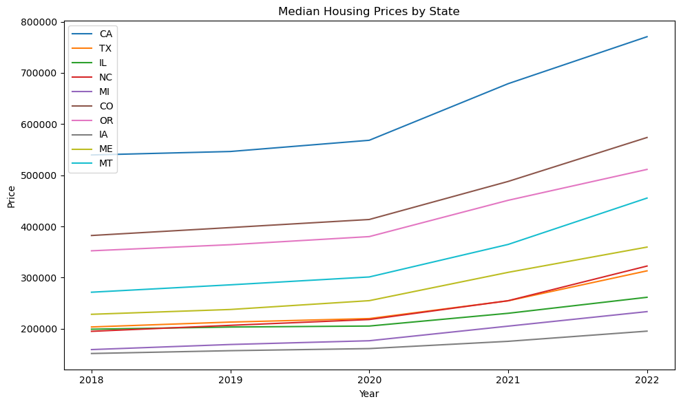
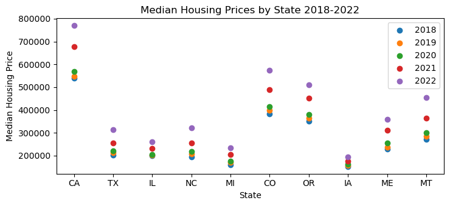
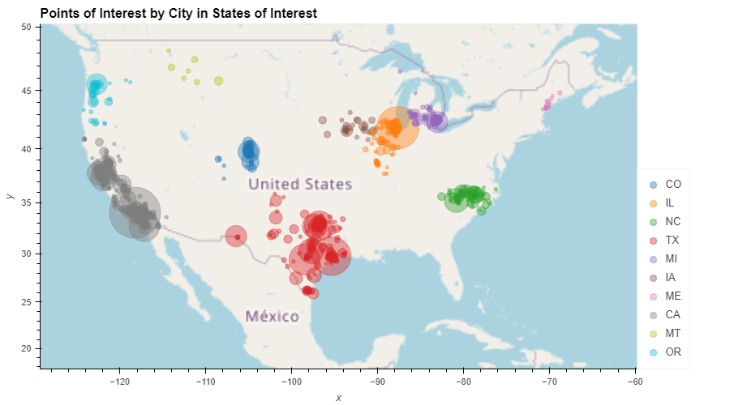
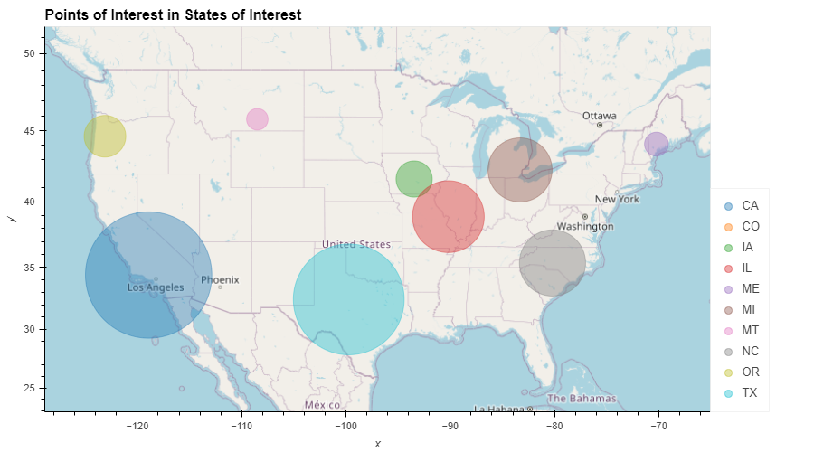
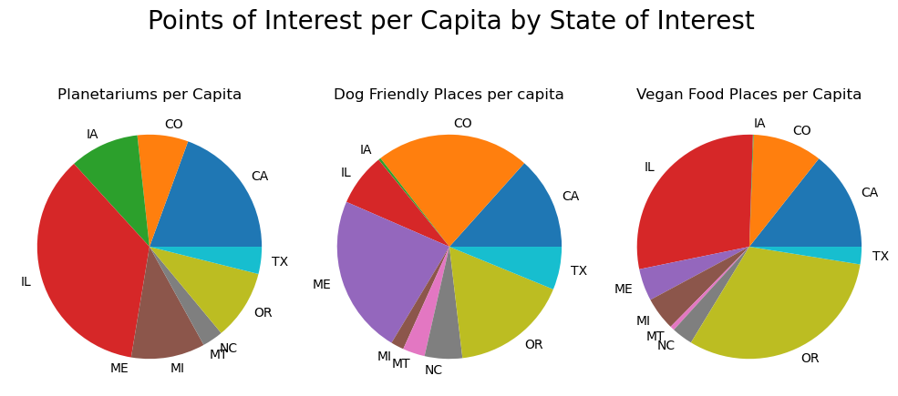
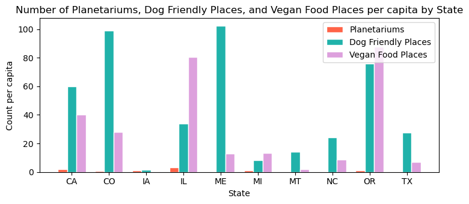

# Personalized Relocation Helper README

#### Task List

Alejandra (Before Class):

* [X] Crime per capita dataframe - make sense of what values need to go in there
* [ ] Subplot for horizontal stacked bar graphs
* [ ] Summary of Crime findings
* [ ] Presentation Slide Deck

Monday Class/After

* [ ] Make sure all visualizations are properly labeled, have titles, etc.
* [ ] Save PNGs of visualizations
* [ ] Maybe screen grab relevant code
* [ ] Rehearse presentation

* I'm not totally sure we actually have to do these for a fourth question. Let's discuss:

* [ ] Crime and Housing Visualization
* [ ] Housing and POI Visualization
* [ ] Summary of Comparative Visualizations

**Things needing to be addressed:**

* [ ] *Crime Visualization - subplotting horizontal stacked bar graph for each year
* [ ] Crime Visualization - some other graphic...
* [ ] Summary of Crime Visualization (plug in on READMe and Notebook)
* [X] *Housing Visualization - multiple line graph comparing states (saved as .png file)
* [X] *Housing Visualization - scatter plot comparing states with years as data points in the space of price and state (saved as .png file)
* [X] Summary of Housing Visualization (plug in on READMe and Notebook)
* [X] *POI Visualization - POI by Cities in States map (saved as .png file))
* [X] *POI Visualization - POI by States map (saved as .png file)
* [X] *POI Visualization - subplot of pie charts POI per capita
* [X] *POI Visualizatoin -
* [X] Summary of POI Visualization (plug in on READMe and Notebook)
* [ ] ?*Comparing Crime and Housing Visualization
* [ ] ?*Comparing Housing and POI Visualization
* [ ] ?Summary of Comparative Visualizations
* [ ] Update READMe
* [ ] Slide Presentation
* [ ] Script/Decide who covers what in presentation
* [ ] Commit to Github (we can do this after we present)
* [ ] Submit for grading!

#### Presentation (7min, 3min for QnA)

* [X] An executive summary or overview of the project and project goals:

* Project Description/Outline: We're in the relocation business. We already have a solid method for moving people here, there, and everywhere, but business is slow. After doing some market research, we learned that there are lots of people out there who would like to move, but are having trouble finding where to move. That's where the Personalized Relocation Helper (PRH) come in! While we're in the beginning stages of developing the PRH in the hopes of marketing it as a free tool that will hopefully generate business!
* The presentation you are about to see hopes to give us some insight into the three categories people often consider when moving: Crime, Housing Price, and the Coolness (not in terms of weather, but in terms of having cool places to go!).
* We're using a sample of 10 states (States of Interst: California, Michigan, Texas, Colorado, North Carolina, Maine, Montana, Iowa, Oregon, and Illinois). We'll look at the crime data for each of these states, categorized by violent and non-violent. We'll look at the median housing price, and then we'll look at points of interest. For the purposes of this initial launch, we've narrowed down points of interest a bit further to include places within 5 miles of a city (pop 15000+) in one of the States of Interest. Our goal is to help our demo client visualize and understand the data collected to help them in selecting a state.

* [X] An overview of the data collection, cleanup, and exploration processes:Describe the source of your data and why you chose it for your project.

* Use the Data section from the below README

* [X] The approach that your group took to achieve the project goals:

* Use Limitations secion from the below README

* [X] The results/conclusions of the application or analysis:

* Use saved png files to show visuzalizations
* Use Visualizations section below
* [X] Next steps: Briefly discuss potential next steps for the project.

* This trial demo demonstrated how much further we would have to go to harness data. We've been exposed to a lot of new concepts, such as web scraping that could help in collecting more varied data. We've also recognized that even good data sets have their limitations, which sometimes aren't realized early enough. We'll be tabeling this project for now while our dedicated team learns more in a Data Bootcamp. Hopefully they'll come out of it with a better idea of how to approach and some day complete our Personalized Relocation Helper.

#### Requirements Check

* [ ] **Completed Analysis Uploaded to GitHub (20 points)**

* [ ] Final data analysis contains ample and complete information in README file (10 points)
* [ ] Final repository is acceptable for professional quality presentation (10 points)

* [ ] **Visualizations (20 points)**

* [ ] 6–8 visualizations of data (at least two per question) (10 points)
* [ ] Clear and accurate labeling of images (5 points)
* [ ] Visualizations supported with ample and precise explanation (5 points)

* [ ] **Analysis and Conclusion (20 points)**

* [ ] Write-up summarizes major findings and implications at a professional level (5 points)
* [ ] Each question in the project proposal is answered with precise descriptions and findings (5 points)
* [ ] Findings are strongly supported with numbers and visualizations (5 points)
* [ ] Each question response is supported with a well-discerned statistical analysis from lessons (e.g., aggregation, correlation, comparison, summary statistics, sentiment analysis, and time series analysis) (5 points)

* [ ] **Group Presentation (20 points)**

* [ ] All group members spoke during the presentation (5 points)
* [ ] Group was well prepared (5 points)
* [ ] Presentation is relevant to material (5 points)
* [ ] Presentation maintains audience interest (5 points)

* [ ] **Slide Deck (20 points)**

* [ ] Slides are visually clean and professional (5 points)
* [ ] Slides are relevant to material (5 points)
* [ ] Slides effectively demonstrate the project (5 points)
* [ ] Slides are clear and maintain audience interest (5 points)

## REMOVE THIS LINE AND EVERYTHING ABOVE BEFORE SUBMISSION

Exploring Crime, Housing Prices, and Points of Interest (POI) )in 10 US States (California, Michigan, Texas, Colorado, North Carolina, Maine, Montana, Iowa, Oregon, Illinois)

## Overview

This project analyzes crime data, housing prices, and points of interest (POI) data for 10 US States of Interest. The crime data includes violent, non-violent, and total crime for each state in 2018-20022. The housing prices data includes the median housing price for each state from 2018-2022. The POI data provides the number of nearby Planetariums, Dog Friendly places, and Vegan Food for cities in each state.

## Dependencies

* hvplot.pandas
* pandas
* requests
* json
* matplotlib.pyplot
* matplotlib.ticker
* geonamescache
* API Keys for Geoapify and FBI CDE must be included in a config.py file

## Data

### Crime Data

The crime data is collected using the [FBI Crime Data Explorer API]([https://cde.ucr.cjis.gov/LATEST/webapp/#/pages/docApi](https://cde.ucr.cjis.gov/LATEST/webapp/#/pages/docApi)). The API retrieved data on several types of crime *where a charge was made* in each state from 2018-2021 and that was then reported with the Uniform Crime Reporting Program. The types of crime were then sorted to violent and non-violent* crimes and then totaled. This was then pivoted to more clearly display the data. Additionally, the Wikipedia [List of U.S. states and territories by population ](https://en.wikipedia.org/wiki/List_of_U.S._states_and_territories_by_population)site is used to read into a table to collect the most recent (July 1, 2022 est.) population for each of the States of interest. The population for each state is captured on a DataFrame and then merged with the crime pivot DataFrame. The data is then adjusted per capita (100,000) to provide a more accurate comparison between states regardless of their population size, which eases the bias towards more populous states.

*Note: While violent and non-violent crimes both have significant consequences to individuals and communities, violent crimes are considered more serious due to the physical harm caused, and therefore separate. 

* Violent crime includes four offenses: Murder and Non-negligent 			 	Manslaughter, Rape, Robbery, and Aggravated Assault.
* Non-violent crime includes All Other Offenses (Except Traffic), Arson, Burglary, Curfew and Loitering Law Violations, Disorderly Conduct, Driving Under the Influence, Drug Abuse Violations - Grand Total, Drunkenness,
  Embezzlement, Forgery and Counterfeiting, Fraud, Gambling - Total, Human
  Trafficking - Commercial Sex Acts, Human Trafficking - Involuntary
  Servitude, Larceny - Theft, Liquor Laws, Manslaughter by Negligence,
  Motor Vehicle Theft, Offenses Against the Family and Children,
  Prostitution and Commercialized Vice, Stolen Property: Buying,
  Receiving, Possessing, Suspicion, Vagrancy, Vandalism, Weapons:
  Carrying, Possessing, Etc., Sex Offenses (Except Rape, and Prostitution
  and Commercialized Vice), Simple Assault.

### Housing Prices

The housing price data is collected from a csv file on the [Zillow Research Data](https://www.zillow.com/research/data/) website. The data was narrowed to only include 2018-2022 data for the 10 states of interest. Interpolate was used to get the average of adjacent cells in a State row when there was an absent value. The median house price for each year by state was then calculated.

### Points of Interest

Using [GeonamesCache](https://pypi.org/project/geonamescache/), a list of cities (pop. >15000) in each of the states of interest generates. Then, [Geoapify](https://apidocs.geoapify.com/) searches for Planetariums, places where dogs are allowed, and places where you can get vegan food within a 5 mile radius of each city. These three variables were selected based on the idea of a demo client wanting to further narrow down their search for a place to relocate. The data is then adjusted per capita (1,000,000)to provide a more accurate comparison between states regardless of their population size, which eases the bias towards more populous states. Additionally, the Wikipedia [List of U.S. states and territories by population ](https://en.wikipedia.org/wiki/List_of_U.S._states_and_territories_by_population)site is used to read into a table to collect the most recent (July 1, 2022 est.) population for each of the States of interest. The population for each state is captured on a DataFrame and then merged with the DataFrame containing POIs in States of interest. The data is then adjusted per capita (100,000) to provide a more accurate comparison between states regardless of their population size, which eases the bias towards more populous states.

## Visualizations

### Visualizing Violent, Non-Violent, and Total Crime in States of Interest

1. How does violent, non-violent, and total crime compare across 2018-2021 for our States of Interest?
   The total number of crimes has decreased from 2018 to 2021 in most states. Some states have vastly different crimes rates (that were reported and recorded, see caveat!). Here are two visualizations to show that:

   *insert horizontal stacked bar graph
   *The subplot of horizontal stacked bar graphs visualizes the comparison of violent, non-violent, and total crimes per state in each year (2018, 2019, 2020, 2021)

   *insert visualization_type

   *The visualization_type shows...

### Visualizing Median Housing Prices in States of Interest

1. How do median housing prices compare for our States of Interest from 2018-2022?
   We have two visualizations below to show that housing prices have gone up over time across the states, with a slow down in 2020 before seeing a steeper incline.

The multiple line graph visualizes the prices of homes over time with lines representing each state.

The scatter plot visualizes the prices of homes by state with the data points representing each year (2018-2022).

### Visualizing Points of Interest in States of Interest

1. Where can I find the points of interest in our states of interest on a map by city and state?
   We have two maps below to show where the points of interest are. It's interactive in the notebook so you can also hover over a radius (in relation to the city or state population) and see the number of POIs in the area as well as the city or state population.

   

   The above map displays POIs in cities in states of interest.

   The above map displays POIs in states of interest.

   2. What states have the most Planetariums, Dog Friendly Places, and Vegan Food Places per capita?
      Illinois has the most Planetariums per capita, Maine has the most Dog Friendly Places per capita at 102.50 though Colorado is close behind with 98.97, and Oregon has the most Vegan Food Places at 87.49 though Illinois isn't too far behind with 80.67.

      

   The above subplot of piecharts visualizes how states compare based on each POI.
   

   The above grouped barchart is another way to visualize how states compare based on each POI.

## Limitations

* Ideally, this project would have included the ability to more easily make selections for states of interest and points of interest to broaden its usefullness.
* Current crime data is limited by state and is unavailable to be pulled by city without proper authorization. This limits the ability to zoom in on additional comparisons that could have otherwise been made.
* As noted earlier, the crime data only includes crime where a charge was made. This does not include reported crimes or undocumented crimes.
* Not all law enforcement agencies provide data or do so timely. This is particularly noteworthy in the case of IL, which only had 328 out of 934 reporting law enforcement agencies in the year 2021 compared to TX having 1006 out of 1,197 agencies reporting.
  * In the case that there is missing data, the FBI reports using estimates based on any reported data they receive as long as it is between 3-11 months of data. If nothing is received, the FBI estimates by using known crime figures of similar areas within the state. There is a concern there may be a deeper discrepancy in the data than is currently realized.
* There are some duplicated POIs due to the radius overlapping at times between cities and counting some POI more than once. Unfortunately, this could not be resolved in time for submission of the project.
* No statistical analysis testing was able to be completed during the course of this project, though steps were taken to attempt to ensure solid data sources were obtained and methods to exclude absent data appropriately were used.

## Collaborators

* Lisa Drain
* Alejandra Gomez
