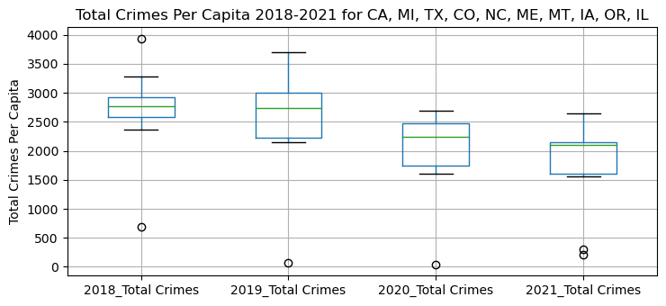
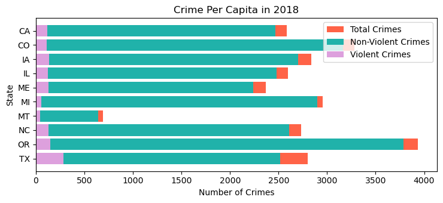
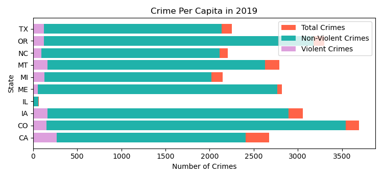
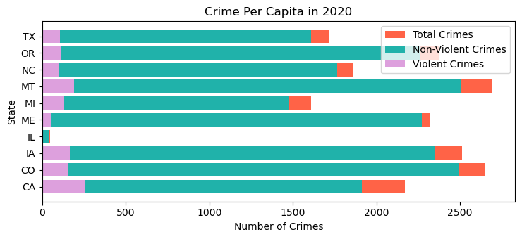
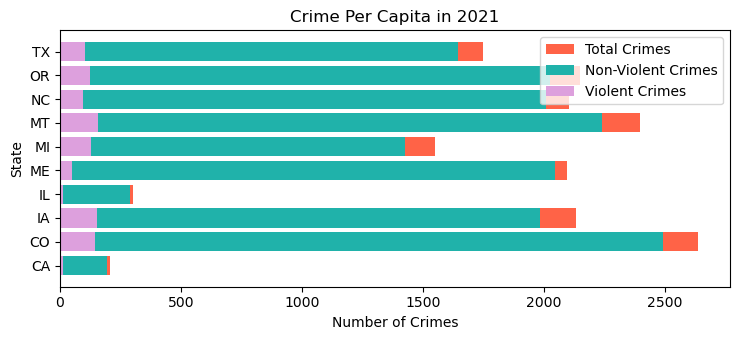
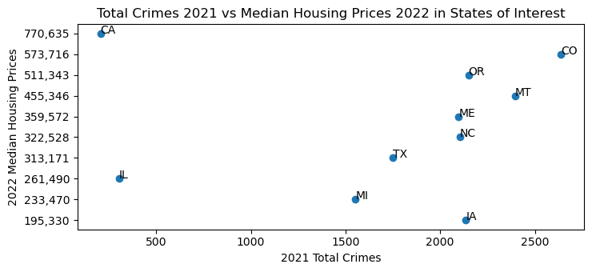
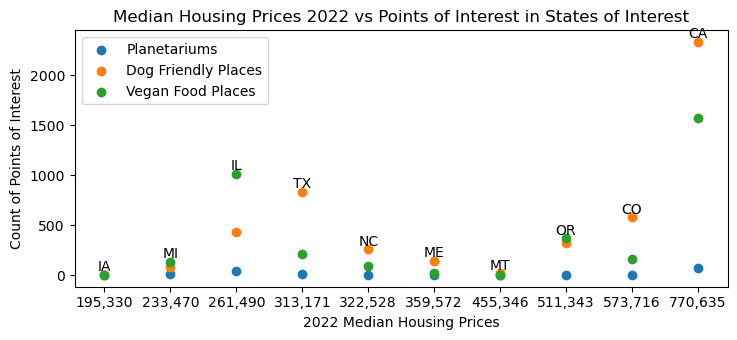
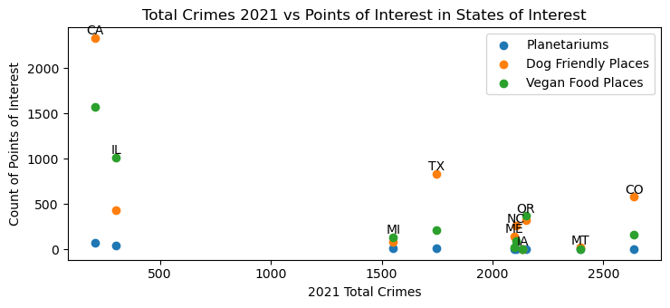

# Personalized Relocation Helper README

Exploring Crime, Housing Prices, and Points of Interest (POI) )in 10 US States (California, Michigan, Texas, Colorado, North Carolina, Maine, Montana, Iowa, Oregon, Illinois) in order to help a demo client find the best suited states for their concerns and interests.

## Overview

This project analyzes crime data, housing prices, and points of interest (POI) data for 10 US States of Interest. The crime data includes violent, non-violent, and total crime for each state in 2018-20022. The housing prices data includes the median housing price for each state from 2018-2022. The POI data provides the number of nearby Planetariums, Dog Friendly places, and Vegan Food for cities in each state.

## Dependencies

* hvplot.pandas
* pandas
* requests
* json
* numpy
* matplotlib.pyplot
* matplotlib.ticker
* geonamescache
* ssl
* API Keys for Geoapify and FBI CDE must be included in a config.py file

## Data

### Crime Data

The crime data is collected using the [FBI Crime Data Explorer API]([https://cde.ucr.cjis.gov/LATEST/webapp/#/pages/docApi](https://cde.ucr.cjis.gov/LATEST/webapp/#/pages/docApi)). The API retrieved data on several types of crime *where a charge was made* in each state from 2018-2021 and that was then reported with the Uniform Crime Reporting Program. The types of crime were then sorted to violent and non-violent* crimes and then totaled. This was then pivoted to more clearly display the data. Additionally, the Wikipedia [List of U.S. states and territories by population ](https://en.wikipedia.org/wiki/List_of_U.S._states_and_territories_by_population)site is used to read into a table to collect the most recent (July 1, 2022 est.) population for each of the States of interest. The population for each state is captured on a DataFrame and then merged with the crime pivot DataFrame. The data is then adjusted per capita (100,000) to provide a more accurate comparison between states regardless of their population size, which eases the bias towards more populous states.

*Note: While violent and non-violent crimes both have significant consequences to individuals and communities, violent crimes are considered more serious due to the physical harm caused, and therefore separate.

* Violent crime includes four offenses: Murder and Non-negligent Manslaughter, Rape, Robbery, and Aggravated Assault.
* Non-violent crime includes All Other Offenses (Except Traffic), Arson, Burglary, Curfew and Loitering Law Violations, Disorderly Conduct, Driving Under the Influence, Drug Abuse Violations - Grand Total, Drunkenness, Embezzlement, Forgery and Counterfeiting, Fraud, Gambling - Total, Human Trafficking - Commercial Sex Acts, Human Trafficking - Involuntary Servitude, Larceny - Theft, Liquor Laws, Manslaughter by Negligence, Motor Vehicle Theft, Offenses Against the Family and Children, Prostitution and Commercialized Vice, Stolen Property: Buying, Receiving, Possessing, Suspicion, Vagrancy, Vandalism, Weapons: Carrying, Possessing, Etc., Sex Offenses (Except Rape, and Prostitution and Commercialized Vice), Simple Assault.

### Housing Prices

The housing price data is collected from a csv file on the [Zillow Research Data](https://www.zillow.com/research/data/) website. The data was narrowed to only include 2018-2022 data for the 10 states of interest. Interpolate was used to get the average of adjacent cells in a State row when there was an absent value. The median house price for each year by state was then calculated.

### Points of Interest

Using [GeonamesCache](https://pypi.org/project/geonamescache/), a list of cities (pop. >15000) in each of the states of interest generates. Then, [Geoapify](https://apidocs.geoapify.com/) searches for Planetariums, places where dogs are allowed, and places where you can get vegan food within a 5 mile radius of each city. These three variables were selected based on the idea of a demo client wanting to further narrow down their search for a place to relocate. The data is then adjusted per capita (1,000,000)to provide a more accurate comparison between states regardless of their population size, which eases the bias towards more populous states. Additionally, the Wikipedia [List of U.S. states and territories by population ](https://en.wikipedia.org/wiki/List_of_U.S._states_and_territories_by_population)site is used to read into a table to collect the most recent (July 1, 2022 est.) population for each of the States of interest. The population for each state is captured on a DataFrame and then merged with the DataFrame containing POIs in States of interest. The data is then adjusted per capita (100,000) to provide a more accurate comparison between states regardless of their population size, which eases the bias towards more populous states.

## Visualizations

### Visualizing Violent, Non-Violent, and Total Crime in States of Interest

1. How does violent, non-violent, and total crime compare across 2018-2021 for our States of Interest?
   The total number of crimes has decreased from 2018 to 2021 in most states. Some states have vastly different crimes rates (that were reported and recorded, see caveat!). Here are two visualizations to show that:

   

   *The box plot shows there are some outliers for total crime in 2018-2021 per capita (100,000). Illinois is an outlier for each year with significantly fewer reported crimes, and when inspecting the provided data set from the FBI we found low law enforcement participation in reporting for Illinois. California is also in the bottom quartile for 2021, which is a year where they had a huge drop in reporting agencies as well. We also have Colorado as an outlier in 2018, where there were far more crimes reported and it's unclear why this may be.

   

   *The horizontal stacked bar graphs visualizes the comparison of violent, non-violent, and total crimes per state in each year (2018, 2019, 2020, 2021)

### Visualizing Median Housing Prices in States of Interest

1. How do median housing prices compare for our States of Interest from 2018-2022?
   We have two visualizations below to show that housing prices have gone up over time across the states, with a slow down in 2020 before seeing a steeper incline.

The multiple line graph visualizes the prices of homes over time with lines representing each state.

The scatter plot visualizes the prices of homes by state with the data points representing each year (2018-2022).

### Visualizing Points of Interest in States of Interest

1. Where can I find the points of interest in our states of interest on a map by city and state?
   We have two maps below to show where the points of interest are. It's interactive in the notebook so you can also hover over a radius (in relation to the city or state population) and see the number of POIs in the area as well as the city or state population.

   

   The above map displays POIs in cities in states of interest.

   The above map displays POIs in states of interest.

   2. What states have the most Planetariums, Dog Friendly Places, and Vegan Food Places per capita?
      Illinois has the most Planetariums per capita, Maine has the most Dog Friendly Places per capita at 102.50 though Colorado is close behind with 98.97, and Oregon has the most Vegan Food Places at 87.49 though Illinois isn't too far behind with 80.67.

      

   The above subplot of piecharts visualizes how states compare based on each POI based on each POI oriented by time.
   

   The above grouped barchart is another way to visualize how states compare based on each POI.

### Comparative Visualizations

1. How can our demo client compare across these points of data?
   For our demo client to better visualize comparisons between the Crime, Housing, and POI data, we created three scatter plots.

   

   The above scatter plot is comparing the most recent data for Crime (2021) and Median Housing Prices (2022) by State of Interest

   

   The above scatter plot is comparing the most recent data fro Median Housing Prices (2022) and POI by State of Interest

   The above scatter plot is comparing the most recent data for Crime (2021) and POI by State of Interest

## Limitations

* Ideally, this project would have included the ability to more easily make selections for states of interest and points of interest to broaden its usefullness.
* Current crime data is limited by state and is unavailable to be pulled by city without proper authorization. This limits the ability to zoom in on additional comparisons that could have otherwise been made.
* As noted earlier, the crime data only includes crime where a charge was made. This does not include reported crimes or undocumented crimes.
* Not all law enforcement agencies provide data or do so timely. This is particularly noteworthy in the case of IL, which only had 328 out of 934 reporting law enforcement agencies in the year 2021 compared to TX having 1006 out of 1,197 agencies reporting. For 2021, California only had 15 of 740 reporting law enforcement agencies though in prior years they had significantly more participation (in 2021 it was 732 of 740 agencies).
  * In the case that there is missing data, the FBI reports using estimates based on any reported data they receive as long as it is between 3-11 months of data. If nothing is received, the FBI estimates by using known crime figures of similar areas within the state. However, there is a concern that this has done been included in the data.
* There are some duplicated POIs due to the radius overlapping at times between cities and counting some POI more than once. Unfortunately, this could not be resolved in time for submission of the project.
